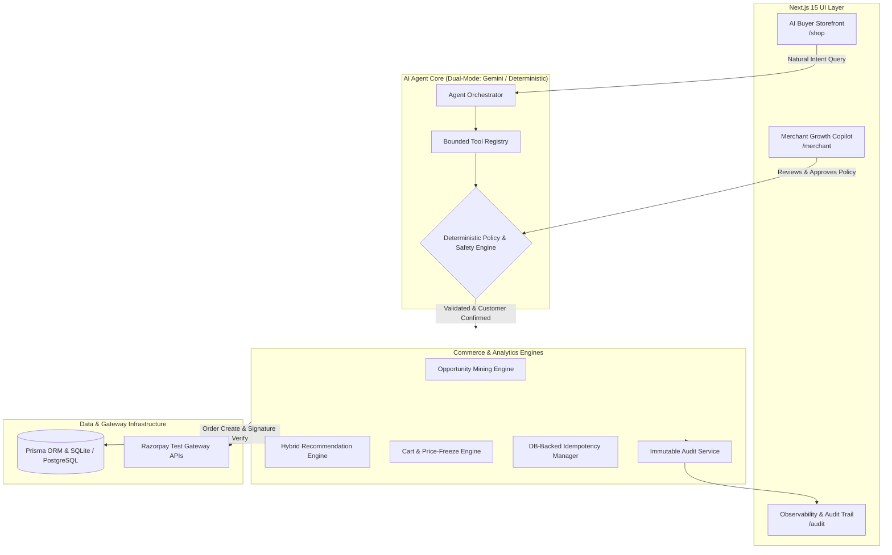

# RazorGrow AI — Autonomous Agentic Commerce Engine

> **Razorpay AI Buildathon — Track 1: AI Growth & Agentic Commerce**  
> *Autonomous AI commerce agent that helps merchants discover revenue opportunities, recommend bounded growth actions, and safely convert AI-assisted shoppers into successful Razorpay payments.*

---

## 1. Executive Summary

Most conversational shopping applications are shallow wrappers ("ChatGPT + Checkout Link") where the AI operates in a silo, lacks domain intelligence, and presents severe financial safety risks.

**RazorGrow AI** closes the loop between **Merchant Revenue Intelligence** and **AI-Native Buyer Commerce**:
1. **The Merchant Side**: Continuously scans transaction graphs and funnel drop-offs, identifies revenue opportunities (e.g., high-affinity attachments, price elasticity barriers), and calculates statistical evidence with estimated financial impact.
2. **Human-in-the-Loop Policy Gate**: Consequential campaigns and discounts require explicit merchant review and approval before they become active.
3. **The Buyer Side**: Conversational storefront agent understands natural language shopper intent, queries structured product graphs, explains companion upgrades using approved merchant data, and builds carts.
4. **Deterministic Financial Safety Layer**: The LLM proposes actions, but deterministic code validates limits, enforces customer confirmation gates, freezes prices from the database, protects against duplicate payments with idempotency locks, and verifies Razorpay HMAC-SHA256 signatures.
5. **Traceability**: An immutable, structured audit trail records every intent, tool invocation, risk evaluation, and payment result.

---

## 2. System Architecture



---

## 3. Key Product Experiences

### Experience A — Merchant AI Growth Copilot (`/merchant`)
- **Revenue Analytics**: Real-time breakdown of baseline revenue, AI-attributed uplift, upsell conversion rate, and cart drop-offs.
- **Opportunity Mining**: Detects item affinities (e.g. 38.2% attach probability between laptops and mechanical keyboards), price elasticity bottlenecks, and high-value customer churn signals.
- **Explainable Evidence**: Shows underlying sample sizes, attach lift estimates, and expected monthly revenue lift in ₹ INR.
- **Human Gating**: Merchants inspect risk levels and approve or reject promotional campaigns with a single click.

### Experience B — AI Buyer Conversational Storefront (`/shop`)
- **Natural Intent Parsing**: Understands fuzzy requirements (e.g. *"I need a laptop setup for college under ₹70,000"*).
- **Agent-Readable Catalog**: Searches structured fields (specs, ports, dimensions, compatibility lists).
- **Deterministic Recommendations**: Ranks products by compatibility, budget, and active merchant-approved promotions.
- **Customer Confirmation Gate**: Prompts for explicit user approval before triggering financial checkout.
- **Razorpay Standard Checkout**: Launches Razorpay test modal with automatic signature verification.
- **Graceful Failure Recovery**: Simulates gateway declines, preserves cart state, prevents duplicate orders via idempotency keys, and guides user recovery.

### Experience C — Compliance & Safety Audit Trail (`/audit`)
- Real-time ledger of every actor (`BUYER`, `MERCHANT`, `AGENT`, `SYSTEM`), tool invocation, risk score, decision badge (`ALLOWED`, `BLOCKED`, `GATED_APPROVED`), and exact JSON input/output payloads.

---

## 4. Agent Tool Registry

| Tool | Parameters | Deterministic Safety Boundary |
| :--- | :--- | :--- |
| `search_catalog` | `query`, `category`, `maxPrice`, `minPrice`, `limit` | Enforces budget caps and structured catalog filtering. |
| `get_product_details` | `productIdOrSku` | Resolves full technical specs, compatibility, and views. |
| `compare_products` | `productSkus` (2 to 4 items) | Generates side-by-side specification comparison. |
| `get_recommendations` | `targetCategory`, `cartProductIds`, `maxBudgetINR` | Calculates hybrid score from compatibility + approved merchant policies. |
| `add_to_cart` | `sessionId`, `productIdOrSku`, `quantity`, `isUpsell` | Modifies active cart and recomputes verified subtotal. |
| `get_cart_summary` | `sessionId` | Formats item count, line items, and discounts. |
| `request_customer_confirmation` | `sessionId`, `orderSummaryText`, `totalAmountINR` | Transitions session state to `CUSTOMER_CONFIRMATION`. |
| `create_payment_order` | `sessionId`, `customerEmail`, `idempotencyKey`, `confirmedByCustomer` | **GATED**: Requires `confirmedByCustomer === true`, checks idempotency key, validates merchant limits, freezes prices, and creates Razorpay order. |
| `verify_payment` | `orderId`, `razorpayOrderId`, `razorpayPaymentId`, `razorpaySignature` | **GATED**: Validates HMAC-SHA256 signature, updates order to `PAID`, decrements inventory, and marks cart converted. |

---

## 5. Quick Start & Setup Instructions

### Prerequisites
- Node.js 18+ (Tested on Node.js v24)
- npm or yarn

### 1. Clone & Install
```bash
git clone <repo-url>
cd razorgrow-ai
npm install
```

### 2. Configure Environment Variables
Copy `.env.example` to `.env`:
```bash
cp .env.example .env
```
*(Default settings use local SQLite with mock/test Razorpay credentials for zero-setup evaluation).*

### 3. Initialize & Seed Database
```bash
npx prisma db push
npm run db:seed
```
*Seeds 17 structured products, 4 customer cohorts, 25 settled historical orders, and pre-detected growth opportunities.*

### 4. Run Development Server
```bash
npm run dev
```
Open [http://localhost:3000](http://localhost:3000) in your browser.

---

## 6. Running the Automated Test Suite

```bash
# Run all Vitest unit and safety tests
npm test
```

The test suite validates:
1. **Policy Engine (`tests/unit/policy.test.ts`)**: Rejection of zero/negative amounts, transaction ceiling enforcement, and discount percentage safety rules.
2. **Idempotency Engine (`tests/unit/idempotency.test.ts`)**: Rejection of duplicate concurrent orders and retrieval of cached settled payloads.
3. **Recommendation Engine (`tests/unit/recommendations.test.ts`)**: Product affinity ranking, compatibility matching, and budget filtering.
4. **Tool Calling & Validation (`tests/unit/tools.test.ts`)**: Zod schema conformity and cart calculations.

---

## 7. 3-Minute Evaluator Demo Script

1. **Step 1 — Discover & Approve (Merchant Copilot)**:
   - Navigate to `/merchant`.
   - Review the AI-detected opportunity: *"High Laptop Checkout Affinity: Mechanical Keyboard Upsell"*.
   - Click **Approve Policy**. Notice that the campaign is now active for the buyer agent.
2. **Step 2 — Conversational Shopping (AI Buyer Storefront)**:
   - Navigate to `/shop`.
   - Click the preset prompt: *"I need a laptop setup for college under ₹70,000"*.
   - The agent parses your budget, queries the catalog, recommends the ApexBook Pro 14, and offers the newly approved Keychron Keyboard companion upgrade.
   - Click **Add to Cart** for both items.
3. **Step 3 — Bounded Checkout & Razorpay Settlement**:
   - Type *"Proceed to checkout"* or click **Review & Confirm Order**.
   - Notice the **Financial Action Authorization** modal.
   - Click **Confirm & Pay** to launch Razorpay Test Checkout.
   - Complete test payment $\rightarrow$ Order is settled with HMAC verification.
4. **Step 4 — Verify Audit Trail**:
   - Navigate to `/audit`.
   - Review the complete event chain from natural intent to tool calls to merchant approval and settled Razorpay payment.
5. **Step 5 — Demonstrate Failure Handling**:
   - In `/shop`, click checkout again and click **Simulate Payment Gateway Failure**.
   - Notice that the agent catches the decline, preserves the cart items, prevents duplicate orders, and offers a retry flow.

---

## 8. Razorpay Panel Q&A Preparation Package

### Pitch Versions
- **30-Second Elevator Pitch**: *"RazorGrow AI is an autonomous commerce agent that closes the loop between merchant revenue intelligence and AI buyer checkout. It discovers untapped revenue affinities, gates promotional policies behind merchant approval, guides shoppers through conversational discovery, and executes bounded Razorpay test payments with strict price-locking, idempotency, and audit trails."*
- **1-Minute Product Pitch**: *"Most ecommerce AI is either a merchant analytics dashboard that can't take action, or a simple chatbot that can't be trusted with money. RazorGrow AI bridges both: the merchant copilot mines association rules from transaction history, the merchant approves the bounded policy, and the buyer agent uses that intelligence to recommend relevant upsells during checkout. Every financial step is strictly bounded by deterministic rules, customer confirmation gates, and HMAC-SHA256 signature verification."*

### Defense Answers to Tough Technical Questions

#### Q1: "Why did you use an AI agent instead of traditional rules?"
> *"We use a hybrid architecture. The mathematical calculations (itemset association rules, price delta, inventory, and safety limits) are 100% deterministic. We use the LLM where it excels: understanding messy natural language shopper intent, extracting fuzzy multi-constraint budgets, and dynamically explaining the compatibility and value of companion upgrades in fluent dialogue."*

#### Q2: "How do you prevent the LLM from making unauthorized payments or charging the wrong amount?"
> *"The LLM never touches payment execution. Line-item prices are read and frozen from the database at order creation time, not from LLM arguments. Order creation is blocked unless `confirmedByCustomer === true`, amount is checked against the merchant's transaction limit, and payment settlement requires server-side HMAC-SHA256 cryptographic signature verification."*

#### Q3: "How do you handle duplicate payment requests?"
> *"We implement database-backed idempotency keys with a 15-minute TTL lock. When an order creation or payment attempt is initiated with a key, concurrent requests receive a `PENDING` lock status, and completed requests return the cached settled response without re-executing Razorpay orders."*

#### Q4: "What happens when a payment fails?"
> *"Our system transitions into a dedicated `RECOVERY` state. The cart items and applied discounts are preserved, the failed attempt is recorded in the audit log with error codes, and the user is guided to retry with an alternate test payment method without creating orphaned or duplicate orders."*

---

## 9. License
MIT License. Built for the Razorpay AI Buildathon 2026.
