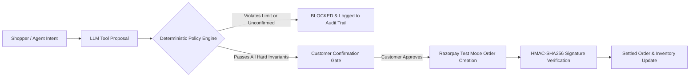

# RazorGrow AI — Security & Financial Safety Architecture

## 1. Core Security Principle: "LLMs Propose, Deterministic Code Disposes"

Large Language Models (LLMs) are stochastic reasoning engines and **must NEVER be directly trusted to execute irreversible financial actions or mutate monetary state**.

In RazorGrow AI:
- The AI agent can search, compare, recommend, and structure carts.
- The AI agent **CANNOT** independently trigger payments, modify order totals after price-lock, charge credit cards, or bypass merchant discount ceilings.
- Consequential actions are strictly bounded by deterministic validation layers and gated behind human authorization.

---

## 2. Financial Safety Guardrails

| Guardrail | Enforcement Mechanism | Failure / Violation Behavior |
| :--- | :--- | :--- |
| **No Silent Payment Execution** | Session State Machine (`CUSTOMER_CONFIRMATION`) | `createPaymentOrderTool` aborts immediately if `confirmedByCustomer !== true`. |
| **Price Freezing Invariant** | DB-backed price resolution | Line-item prices are read directly from `db.product.price` at order creation time, ignoring any arbitrary price parameters submitted by the client or LLM. |
| **Transaction Ceilings** | `validateOrderPolicy` check against `merchant.transactionLimit` | Automatically rejects orders over ₹5,00,000 (configurable per merchant). |
| **Discount Percentage Cap** | `validateOrderPolicy` check against `merchant.policies` | Enforces max discount ceiling (default 20%). Discounts exceeding policy are blocked and flagged with high risk score. |
| **Merchant Promotion Gating** | `Opportunity.status === 'APPROVED'` validation | Buyer Agent cannot offer promotional bundle discounts unless the merchant has explicitly approved the campaign via the Copilot dashboard. |
| **Idempotency Protection** | DB-backed `IdempotencyRecord` table with 15-minute TTL locks | Re-submitting identical payment requests returns the cached response without creating duplicate orders or double-charging. |

---

## 3. Cryptographic Signature & Secret Handling

1. **Zero Client-Side Secret Exposure**:
   - `RAZORPAY_KEY_SECRET` is strictly read on the server (`src/lib/payments/razorpay.ts`).
   - The frontend only receives the public `NEXT_PUBLIC_RAZORPAY_KEY_ID` and the generated `order_id`.

2. **Server-Side HMAC-SHA256 Verification**:
   - Every payment confirmation requires verification of:
     $$\text{HMAC-SHA256}(\text{order\_id} + "|" + \text{payment\_id},\; \text{RAZORPAY\_KEY\_SECRET})$$
   - Mismatched signatures immediately flag the order as `FAILED`, log a security audit event with risk score `0.99`, and halt settlement.

---

## 4. Immutable Audit Trail

Every interaction in the lifecycle of an order produces a structured `AuditLog` entry containing:
- `actor`: `BUYER`, `MERCHANT`, `AGENT`, `SYSTEM`
- `actorType`: `HUMAN`, `LLM`, `WORKER`
- `action`: e.g. `TOOL_CALL:search_catalog`, `MERCHANT_APPROVAL:approved`, `ORDER_CREATED:RAZORPAY_INITIATED`, `PAYMENT_SUCCESS:SETTLED`
- `toolName`: Invoked tool name
- `inputState`: Input parameters
- `outputState`: Output payload or error
- `riskScore`: Computed risk rating (0.0 to 1.0)
- `decision`: `ALLOWED`, `BLOCKED`, `GATED_APPROVED`, `GATED_REJECTED`
- `ipAddress` & `createdAt` timestamp
